# 论文 - Deblur

[TOC]

## 基于模型

> 显式地估计模糊核：
> 1）简单的模糊核假设并不能对诸如被遮挡区域或者深度变化的情况进行建模；
> 2）模糊核的估计对噪声和饱和度非常敏感，不正确的估计会导致隐含清晰图像出现伪影；
> 
> 3）在动态场景中寻找每个像素的空间变化模糊核，需要巨大的内存和算力。

### 非盲去模糊

1. K. Castleman, Digital Image Processing, *Prentice Hall. Inc*, 1998.

    > **逆滤波**
    > 非盲去卷积方法的研究最早可以追溯到上世纪六十年代中期，Nathan 用逆滤波方法来处理由漫游者、探索者等外星探索发射器得到的图像。从此，逆滤波去卷积成了图像复原的一种标准技术。但是这种方法对于噪声非常敏感，在噪声较大的情况下图像恢复的效果不明显。
    > 其方法是：在已知模糊图像和模糊函数的条件下，可以先将图像从空间域转换到频域，求解近似的估计值，再通过傅里叶反变换，得到空间域的复原图像。
    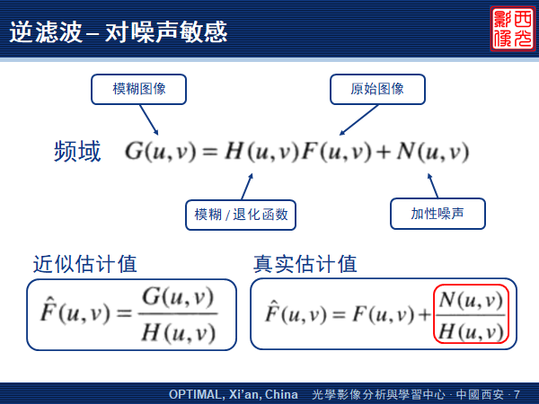
    > 但是很显然，噪声是未知的，也是随机的。如果模糊函数为零，或是非常小的值，也就是说，图像不是特别模糊的情况下，噪声和模糊函数之比就很容易去支配这个估计值。导致图像的复原效果较差。
    >>
    > [Kenneth R. Castleman](https://ieeexplore.ieee.org/author/37294955800)，USA，曾在美国宇航局的喷气推进实验室工作

2. C. Helstrom, "Image Restoration by The Method of Least Squares," *Journal of the Optical Society of America*, vol. 57, no. 3, pp. 297, 1967.

    > **最小均方误差（维纳）滤波**
    > 可以较为有效地复原含有噪声的模糊图像。
    > 这个方法建立在图像和噪声都是随机变量的基础上，它的目标是找到原始清晰图像 $f$ 的一个估计值 $\hat{f}$，并使它们之间的均方误差最小。
    > 通过一系列复杂的推导，我们就可以得到以下这个1942年提出的维纳滤波表达式，方括号内的部分就是最小均方误差滤波器。
    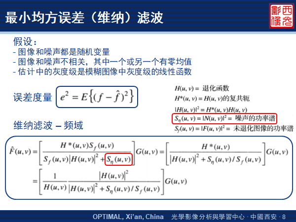
    > 我们从第一个方括号中可以看出，除非对于相同的 $u$ 值和 $v$ 值，整个分母都是零，维纳滤波器没有逆滤波中模糊函数为零的问题。
    > 此外，如果噪声为零，则噪声功率谱消失，维纳滤波也会简化为逆滤波。
    > 虽然处理白噪声的时候，噪声功率谱是一个常数，可以简化处理，但是清晰图像的功率谱却很少是已知的。
    > 所以我们常常会用下面这个式子来近似，其中，$K$ 是两个功率谱的比，它也等于信噪比的倒数。
    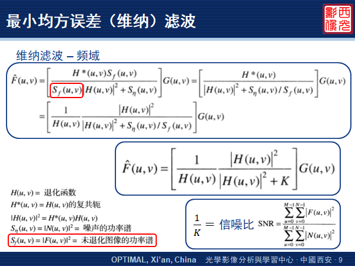
    > 可并不总是能知道信噪比的真实值。
    >>
    > [Carl W. Helstrom](https://en.wikipedia.org/wiki/Carl_W._Helstrom)，量子信息理论领域最早的先驱之一。他因发现了现在称为 Helstrom 测量的东西而闻名于该领域，这是一种用于区分一种量子态与另一种量子态的错误概率最小的量子测量。

3. W. Richardson,"Bayesian-Based Iterative Method of Image Restoration," *Journal of the Optical Society of America*, vol. 62, pp. 55-59, 1972.

    > W. H. Richardson，Lucy-Richardson - **LR 算法**
    > 它是一种基于贝叶斯思想的、空间域上的迭代算法，可以用于模糊函数已知，噪声信息未知的情况。该方法对强噪声图像复原具有鲁棒性，被广泛使用于泊松噪声背景下的天文图像恢复，或者共聚焦显微镜、CT 成像等场景。
    > 其推导过程使用了泊松分布、极大似然和EM算法，下图为最终得到的迭代公式，其中，$f$ 是估计的清晰图像，$h$ 是模糊函数，$g$ 是模糊图像。
    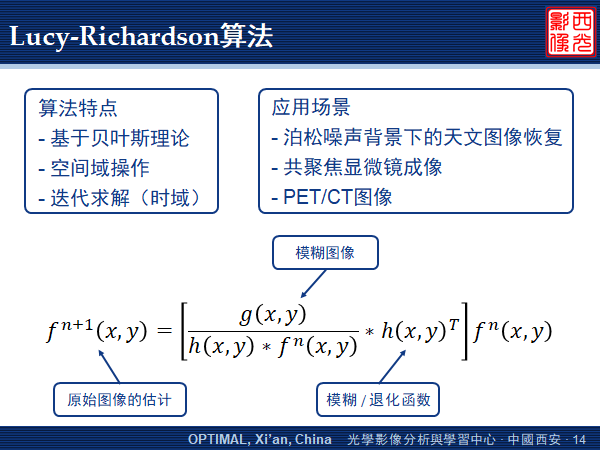
    > 随着迭代次数的不断增加，图像细节恢复得越清晰，但图像边界区域的振铃效应也会越明显。
    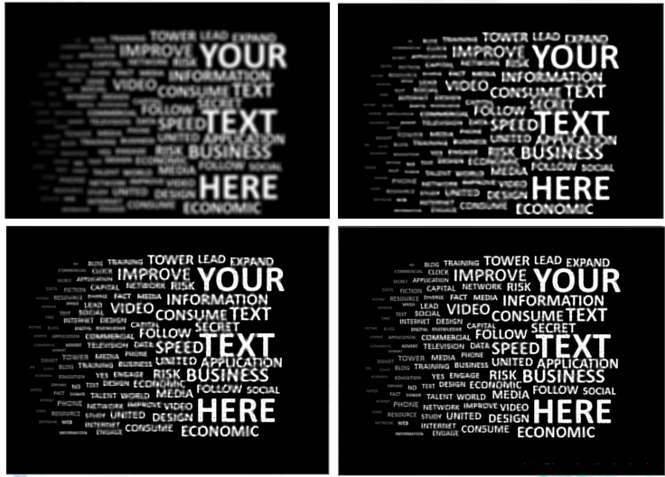
    > LR 算法的一个很明显的缺点，就是没有规定迭代结束的条件，需要人为地去调整，以达到最优的效果。
    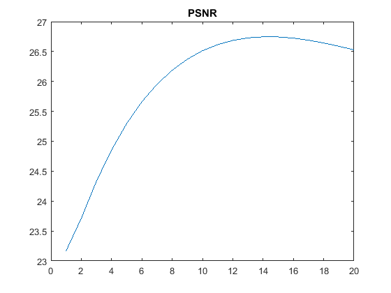
    > 同时，该算法在运行速度上并不理想，这也限制了它在工业上的应用。所以后续也出现了许多加速算法的变种。

4. L. I. Rudin, S. Osher, and E. Fatemi, "Nonlinear Total Variation Based Noise Removal Algorithms," *Physica D: Nonlinear Phenomena*, vol. 60, pp. 259-268, 1992.

    L. I. Rudin and S. Osher, "Total Variation Based Image Restoration with Free Local Constraints," In *Proc. International Conference on Image Processing*, 1994, pp. 31-35.

    > **全变分模型 Total Variation**
    > 该模型能在去噪的同时，有效地保护图像边缘。
    > 变分图像复原是一种确定性的方法，它通过引入能量函数，将图像复原问题转换成求泛函极小值问题，即变分问题。
    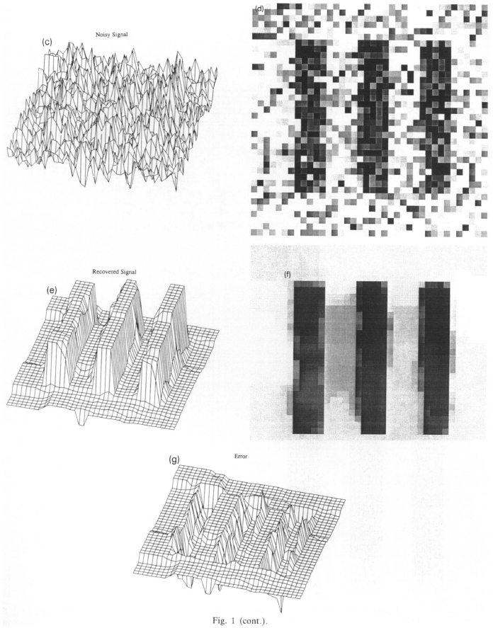
    >>
    > USA

5. M. Willis, B. Jeffs, and D. Long, "Maximum Entropy Image Restoration Revisited," In *Proc. International Conference on Image Processing*, 2000, pp. 89-92.

    > **最大熵**
    > 该方法是一种非线性方法，通过对图像的复原结果加以最大熵约束，即要求复原的图像在满足图像退化模型的前提下，使其图像熵最大，获得比线性方法更好的复原结果。
    >
    > USA

6. P. Hansen, J. Nagy, D. O'leary, and R. Miller, "Deblurring Images: Matrices, Spectra, and Filtering," *Journal of Electronic Imaging*, vol. 17, pp. 019901, 2008.

    > **奇异值分解法**
    > 该方法利用矩阵的奇异值分解，可将退化【点扩散函数 Point Spread Function, PSF】矩阵进行分解，降低了计算量。
    > 但在有噪声存在时，经常会出现不稳定的现象。
    >>
    > [Per Christian Hansen](http://www2.compute.dtu.dk/~pcha/)，[丹麦科技大学](https://www.dtu.dk/english) [应用数学与计算机科学系 Department of Applied Mathematics and Computer Science (DTU Compute)](https://www.compute.dtu.dk/english) [科学计算组](https://www.compute.dtu.dk/english/research/Research-sections/SCO) 教授、技术博士，擅长于数值分析、数值线性代数、迭代重建方法和反问题的计算方法。其工作主要应用于材料科学、图像去模糊、信号分析和天线设计的计算机断层扫描等。
    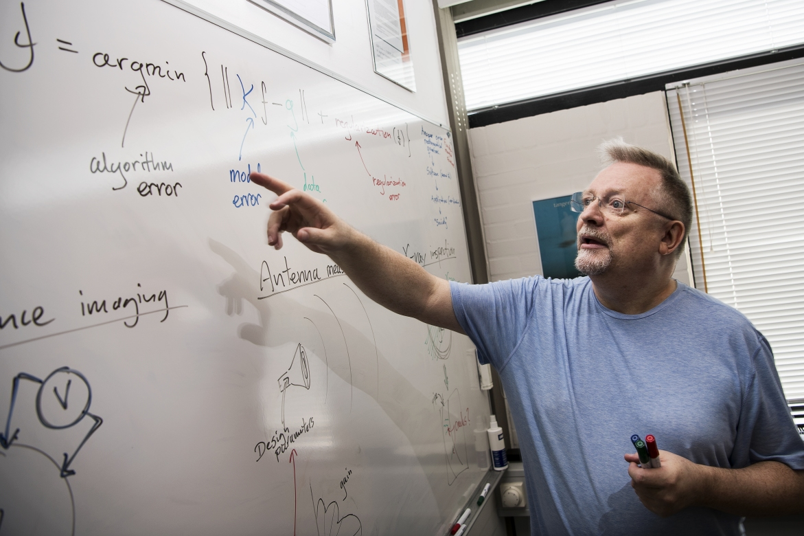

7. A. Levin, R. Fergus, F. Durand, and W. Freeman, "Image and Depth from A Conventional Camera with A Coded Aperture," *ACM Transactions on Graphics*, vol. 26, no. 3, pp. 701-709, 2007.

    > 统计复原方法
    > 该类方法是在贝叶斯框架下通过条件概率最大化来复原图像。
    > 根据自然图像的微分具有**重尾分布**这一特点，引入自然图像稀疏先验模型抑制去卷积振铃效应。相较于高斯先验模型，复原的图像更加清晰，振铃抑制效果好。
    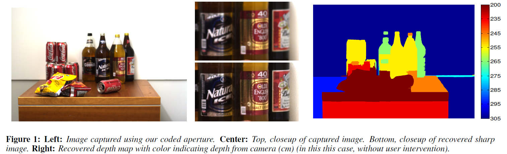
    >>
    > [Anat Levin](https://webee.technion.ac.il/people/anat.levin/)，[以色列理工学院（Israel Institute of Technology, Technion）电气工程系](https://vee.technion.ac.il/)终身副教授，其研究兴趣在计算机视觉、计算机图形学和光学领域，特别致力于计算摄影、显示技术、中低水平视觉。
    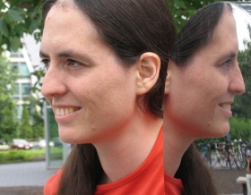

### 盲去模糊

1. J. Jia, "Single Image Motion Deblurring Using Transparency," In *Proc. IEEE Conference on Computer Vision and Pattern Recognition*, 2007, pp. 1-8.

    > **透明度先验 Transparency** - $\alpha$ 值
    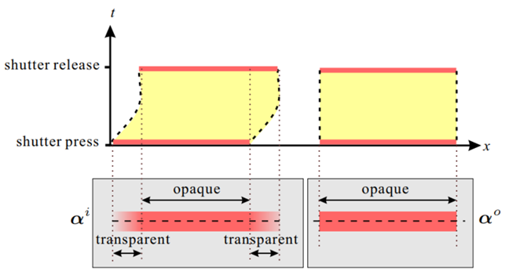
    > 图像上任意一点的颜色值都是由前景颜色和背景颜色混合而成的，其中前景部分颜色所占的比重，称为该点的 $\alpha$ 因子，也可以说 $\alpha$ 是前景部分的透明度。
    > 显然，对于固体、非透明物体，它的透明度等于 1，也就是说它的颜色全部由前景部分组成，背景部分的颜色透不过来。
    > 当物体在相机按下快门和释放快门的这段积分时间内，受到相机抖动或物体运动等影响，其透明度会发生一定的变化。这也是视觉上产生模糊的原因。
    > 由于运动模糊决定了给定模糊目标的 $\alpha$ 抠图（根据目标透明度的软分割方法）的尺寸和透明度变化，因此可以用 $\alpha$ 抠图得到 1D 运动模糊，并分割目标进行复原。该方法可以扩展到 2D 的运动模糊。
    > $\alpha$ 通道建模思想除了应用于去模糊任务，还成功应用于超分辨率重建、数字抠图技术等场景。

2. Q. Shan, J. Jia, and A. Agarwala, "High-Quality Motion Deblurring from A Single Image," *ACM Transactions on Graphics*, vol. 27, no. 3, pp. 1-10, 2008.

    > **heavy tailed**
    > 与 Fergus[^1] 等人的研究相似，也引入了自然图像梯度服从特定统计分布的最新研究成果，即自然图像梯度服从重尾分布，利用分段函数拟合由多幅自然图像得到的梯度分布，并采用 Kim[^2] 等人优化求解方法，依次迭代估计复原图像及其模糊核。
    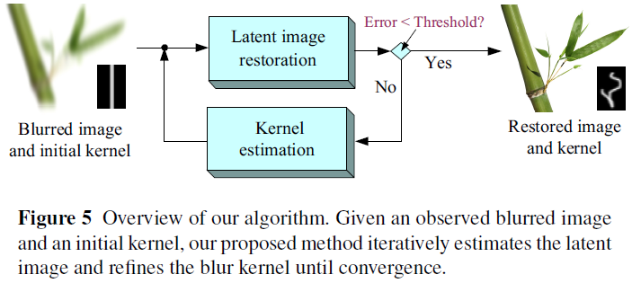
    
    > 虽然这些早期的方法能够估计小规模的模糊核，但是对于较大尺寸的模糊却容易收敛到平凡解，即估计得到的模糊核为【无模糊解释】，而没有任何去模糊效果。
    >
    > [^1]: R. Fergus, B. Singh, A. Hertzmann, S. Roweis, and W. Freeman, "Removing Camera Shake from A Single Photograph," *ACM Transactions on Graphics*, vol. 25, no. 3, pp. 787-794, 2006.
    > [^2]: S. Kim, K. Koh, M. Lustig, and S. Boyd, "An Efficient Method for Compressed Sensing," *IEEE Conference on Image Processing*, vol. 3, pp. 117-120, 2007.

3. J. Pan, D. Sun, H. Pfister, and M.Yang, "Blind Image Deblurring Using Dark Channel Prior," In *Proc. IEEE Conference on Computer Vision and Pattern Recognition*, 2016, pp. 1628-1636.

    > K. He, J. Sun, and X. Tang,"Single Image Haze Removal Using Dark Channel Prior," In *Proc. IEEE Conference on Computer Vision and Pattern Recognition*, 2009, pp. 1956-1963.
    >>
    > **暗通道先验 Dark Channel Prior**
    > 借鉴何凯明 09 年提出的去雾算法：何凯明通过观察5000多幅清晰图像发现，在大部分 **户外** **无雾** 图像的 **无天空** 区域，存在一些像素点在至少一个颜色通道的亮度值很低，接近于 0，这些像素点被称为暗像素，其对应的颜色通道就是暗通道。低亮度主要来源于阴影、彩色或黑色物体的表面等。
    
    > 潘金山教授发现虽然干净图像中的大部分图像块都包含一些暗像素，但这些像素在模糊过程中与邻近的高强度像素平均后并不暗，也就是说，模糊图像的暗通道并不稀疏。
    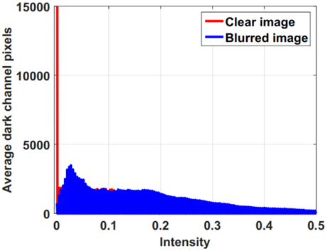
    > 暗通道稀疏性的这种变化是模糊过程的固有特性，因此，加强暗通道的稀疏性有助于在各种场景下消除模糊，包括自然、人脸、文本和低亮度图像。
    > 该算法能够推广到非均匀的去模糊任务，在模糊核的估计中不需要启发式的边缘选择步骤。然而，除了运行速度一般、内存消耗较大之外，其还存在两个比较严重的问题：
    1）暗信道的稀疏性引入了一个非凸非线性优化问题；
    2）假设只有模糊过程改变了暗通道的稀疏性，但其他噪声也可能会影响图像的暗像素，从而干扰模糊核的估计

4. Y. Yan, W. Ren, Y. Guo, R. Wang, and X. Cao, "Image Deblurring via Extreme Channels Prior," In *Proc. IEEE Conference on Computer Vision and Pattern Recognition*, 2017, pp. 6978-6986.

    > 结合暗通道和亮通道两种约束的 **极通道先验 Extreme Channels Prior**
    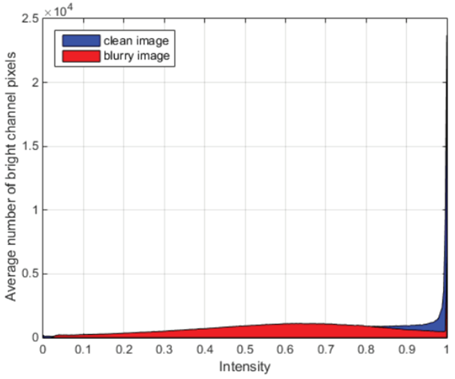
    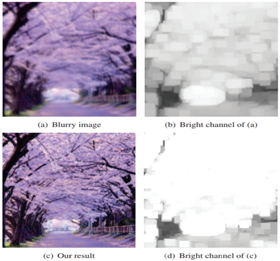
    >>
    > [Yanyang Yan](https://ieeexplore.ieee.org/author/37086238872)，目前在[中国科学院信息工程研究所信息安全国家重点实验室](http://www.sklois.cn/)攻读博士学位。
    > [W. Ren 任文琦](http://www.sklois.cn/rcdw/fg/202007/t20200702_566675.html)，副研究员
    > [Y. Guo 郭园方](http://irip.buaa.edu.cn/andyguo/index.html)，副教授

5. S. Cho and S. Lee, "Fast Motion Deblurring," *ACM Transactions on Graphics*, vol. 28, no. 5, pp. 145:1-145:8, 2009.

    > **显式边缘预测 Sharp Edge Prediction**
    > Joshi[^3] 等人从模糊图像中预测可能的清晰图像，利用该图像和模糊图像通过贝叶斯迭代方法估计 PSF，然后利用估计得到的 PSF 和模糊图像来更新清晰图像，通过多次迭代、更新，最终得到满足最优准则的 PSF 及清晰图像。
    > Cho 等人也用类似的方法估计 PSF，但是他只利用清晰图像的梯度来估计 PSF，模糊图像的卷积用频域上的乘积来代替，从而加快了模糊核估计的速度。
    > 具体来说，该方法在模糊核估计迭代过程中使用简单的双边滤波器和冲击滤波器的组合，对中间去模糊图像进行显式地噪声、细节抑制和边缘增强，并对处理后的梯度图进行阈值化处理，以预测显著的边缘梯度。
    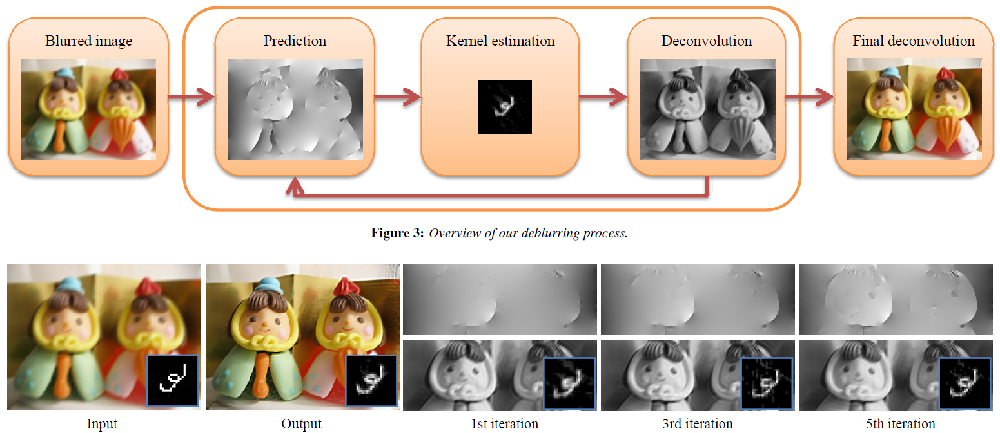
    > 由于该类方法仍然涉及对隐含清晰图像和模糊图像的迭代估计过程，因此可以被认为是基于【最大后验概率 Maximum A Posterior, MAP】估计方法的变体。
    >
    > [^3]: N. Joshi, R. Szeliski and D. Kriegman, "PSF Estimation Using Sharp Edge Prediction," In *Proc. IEEE Conference on Computer Vision and Pattern Recognition*, 2008, pp. 1-8.
    >>
    > [Sunghyun Cho](https://www.scho.pe.kr/)，韩国[浦项科技大学 Pohang University of Science and Technology, POSTECH 计算机图形实验室 Computer Graphics Lab](http://cg.postech.ac.kr/) 副教授

6. L. Yuan, J. Sun, L. Quan, and H. Shum, "Image Deblurring with Blurred / Noisy Image Pairs," *ACM Transactions on Graphics*, vol. 26, no. 3, pp. 1-10, 2007.

    > **长短时曝光**：含噪未模糊短视频 + 不含噪模糊图像
    > 对同一场景进行短时曝光和长时曝光，得到两幅短时曝光的含噪未模糊图像和长时曝光的不含噪的模糊图像，将这两幅图像结合起来估计 PSF，并高质量的实现去卷积，通过对准两幅图像，并对噪声图像进行去噪后作为初始猜测值，通过迭代最小化方法得到清晰图像。
    > 该方法的优点是去噪后的图像作为迭代的初始猜测值是非常好的选择。另外，在去卷积过程中，他们用去噪后的图像作为先验，可提高去卷积质量。

7. L. Chen, F. Fang, T. Wang, and G. Zhang, "Blind Image Deblurring with Local Maximum Gradient Prior," In *Proc. IEEE Conference on Computer Vision and Pattern Recognition*, 2019, pp. 1742-1750.

    > **局部最大梯度先验**
    > 本文提出了LMG（局部最大梯度）先验，该方法受到简单直接的观察启发，发现经过模糊处理的局部图像块的最大梯度值会显著减小，能够基于这个固有特性建立新的能量函数。
    > 本文介绍了一个线性操作来计算局部最大梯度，搭配一个有效的优化方法，该方法可以处理很多特殊场景，包括自然场景，人脸图像，文本图像等。大量的对比实验表明，该方法在合成数据集和真实数据集上都达到了最好的效果。
    >>
    > 华东师范大学

8. T. Kim, B. Ahn, and K. Lee, "Dynamic Scene Deblurring," In *Proc. IEEE International Conference on Computer Vision*, 2013, pp. 3160-3167.

    > **基于分割的方法**
    > 该论文提出了一种联合估计模糊核、隐含清晰图像和运动物体分割的方法，并表示他们的方法可以在一定程度上同时应对相机抖动和物体二维平移运动所引起的运动模糊。
    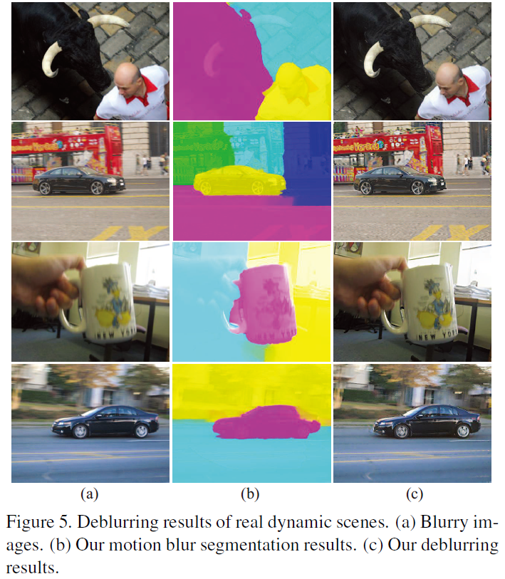
    > 然而实际中单幅模糊图像包含的信息十分有限，除去简单的运动模糊类型如一维线性运动模糊，联合估计大量未知参数的方法在复杂的运动模糊情况下几乎不会收敛到正确的解，且严重依赖于初始分割的设定，因此去模糊后的图像质量很难令人满意。

9. T. Kim and K. Lee, "Segmentation-Free Dynamic Scene Deblurring," In *Proc. IEEE Conference on Computer Vision and Pattern Recognition*, 2014, pp. 2766-2773.

    > 为了消除需要运动分割的限制，Kim 等人提出了一种在**不依赖分割**且无需关心模糊类型的情况下对动态场景进行去模糊的算法。
    > 该算法用二维运动矢量近似局部线性模糊核，通过求解一个优化问题来联合地估计模糊场和隐含的清晰图像。（假设模糊核可以用局部线性光流场来模拟）
    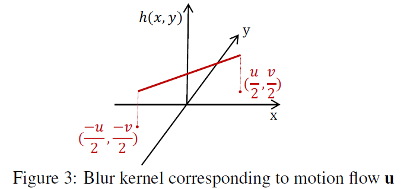
    > 为了在使相邻像素拥有相似的模糊核的同时保持运动边界，该算法采用了图像边缘自适应的运动矢量场加权全变分约束。尽管这种近似方法无需显式地对图像进行分割，然而边界保持的二维运动矢量场在本质上仍倾向于对图像按颜色、灰度值以及运动模糊进行分割。
    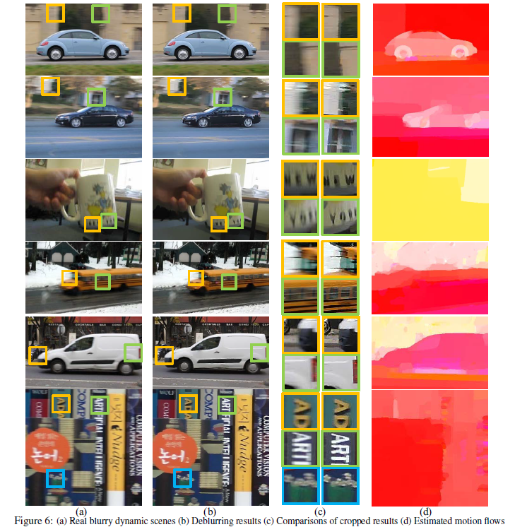
    > 另外该方法只能建模局部直线运动，甚至无法应对简单的非直线空间均匀运动模糊，例如背景相机运动模糊，显然该方法具有明显的局限性。而在实际实现中，单幅模糊图像信息有限，算法的收敛能力也是一个问题。

10. M. Hirsch, S. Sra, B. Schölkopf, and S. Harmeling, "Efficient Filter Flow for Space-Variant Multiframe Blind Deconvolution," In *Proc. IEEE Conference on Computer Vision and Pattern Recognition*, 2010, pp. 607-614.

    > 该论文介绍了一个【高效滤波流程 EFF】框架，该框架允许对【？？？】进行快速的矩阵与向量相乘，同时具有足够的表达能力，以提供空间变化滤波。该框架能够处理多帧的空间变化盲反卷积。
    >>
    > 德国

### 联合深度学习的估计算法

1. J. Sun, W. Cao, Z. Xu, and J.Ponce, "Learning A Convolutional Neural Network for Non-Uniform Motion Blur Removal," In *Proc. IEEE Conference on Computer Vision and Pattern Recognition*, 2015, pp. 769-777.

    > **模糊核候选集合 patch CNN**
    > 虽然用到了深度学习，但其本质仍旧是基于模型的，它通过将图片划分成尽可能多的patch，把原本空间不均匀的模糊，在局部近似地看成是均匀的，然后去估计局部线性的、小范围的模糊。
    > 思想：只要patch足够小，就可以把每个patch的模糊运动轨迹看成是线性的。
    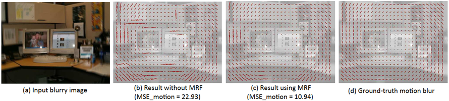
    > 作者先制作了 73 个不同角度和长度的模糊核的候选集，然后在 patch-level 上使用 CNN 来预测运动模糊的概率分布。
    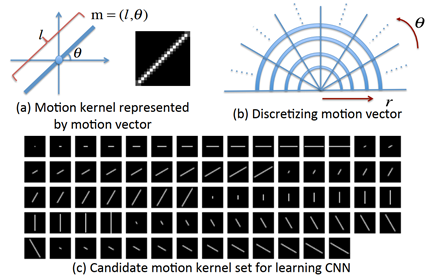
    > 但很显然，作者这么做，是有很大局限性的，因为首先，他的候选集是固定的，只能通过概率统计来估计最接近的结果，而非真实的运动曲线。其次，对patch的尺寸选择会影响性能和运行时间，patch越小，拟合的轨迹越真实，但也需要付出更大的代价。
    >> 执行流程：
    > 1）在patch级上使用CNN来预测运动模糊的概率分布；
    > 2）使用精心设计的旋转图像来进一步扩展CNN所预测运动核的候选集；
    > 3）利用马尔可夫随机场（MRF）模型推断出密集的非均匀运动模糊场，增强了运动的平滑性；
    > 4）最后，使用patch级图像先验的非均匀去模糊模型来去除运动模糊。
    >>
    > [J. Sun 孙剑](http://gr.xjtu.edu.cn/web/jiansun/) - 西安交通大学数学与统计学院 院长助理、教授、优青。研究方向包括图像恢复与识别、医学影像重建等

2. D. Gong, J. Yang, L. Liu, Y. Zhang, I. Reid, C. Shen, A. Hengel, and Q. Shi, "From Motion Blur to Motion Flow: A Deep Learning Solution for Removing Heterogeneous Motion Blur," In *Proc. IEEE Conference on Computer Vision and Pattern Recognition*, 2017, pp. 3806-3815.

    > **基于FCN的端到端运动流图估计算法**
    > 这篇文章的处理方法和 patch CNN 大同小异，他是通过全连接卷积神经网络，从模糊图像中直接估计运动流，将多样化的运动模糊表示为像素级的线性运动模糊，最后再利用所估计的密集运动流图来复原出清晰图像。
    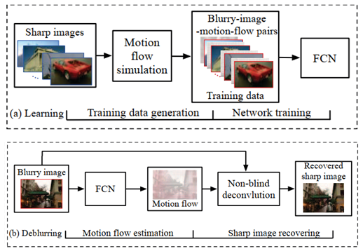
    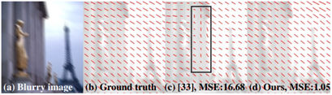
    > 和 patch CNN 的区别，除了直接估计运动流图之外，还提出了一个端到端的普适性框架，几乎没有对底层图像做任何假设，也不需要任何后处理。
    > 但是哪怕他处理的是像素级的运动流图，仍旧无法避免的受限于 patch CNN 中所存在的问题。
    >> 执行流程：
    > 1）输入模拟的运动流图样本来训练FCN；
    > 2）输入模糊图像，通过训练好的FCN，端到端的估计出对应的运动流图；
    > 3）通过非盲去卷积算法，结合估计出的运动流图，复原出清晰图像。
    >>
    > [D. Gong](https://donggong1.github.io/) - 硕博师从西工大张艳宁，目前在[阿德莱德大学 澳大利亚机器学习研究所  Australian Institute for Machine Learning (AIML), part of The University of Adelaide](https://www.adelaide.edu.au/aiml/)工作

## 基于数据

### 多尺度金字塔模型

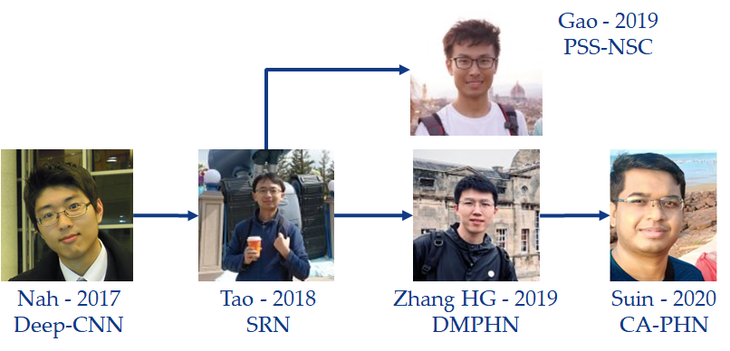

1. S. Nah, T. Kim, and K. Lee, "Deep Multi-Scale Convolutional Neural Network for Dynamic Scene Deblurring," In *Proc. IEEE Conference on Computer Vision and Pattern Recognition*, 2017, pp. 257-265.

    > **deep CNN - Multi Scale**
    > 基于 CNN 和 GAN 的多尺度 deep CNN 算法，将原始模糊图像通过下采样得到尺度更小的图片，每一级的输出都经由类似于上采样的【up convolution layer 上卷积层】”来分享低频信息，学习合适的特征以减少冗余。在该网络的最后一级输出，作者还用到了GAN的思想，使用判别器来判断其为清晰还是模糊图像。并联合【coarse to fine 由粗到细】的多尺度内容损失和对抗性损失来训练模型，大大增加了收敛性。
    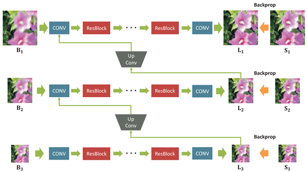
    与传统的 CNN 相比，使用 ResNet 结构可以实现更深层次的架构，而且，由于模糊-清晰图像对的值是相似的，让参数只学习差异会更为有效。相对于原始的 ResBlock，由于训练模型的 Batch 比较小，所以没有使用【Batch Normalization 归一化】。而且通过实验发现，将原始 ResBlock 在快捷连接后的 ReLU 激活层去除，能够提高训练时的收敛速度
    
    这篇文章还提出了一个 GOPRO 数据集，至今仍然是去模糊领域的主要评测基准。在这之前，人们通过模拟模糊过程，将清晰图像通过某个单一固定的模糊核，卷积得到空间均匀的模糊图像，作为静态场景的实验数据。而在动态场景中，Nah 提出平均多张清晰图像的方法，来合成具有局部运动模糊的更加真实的模糊图像。
    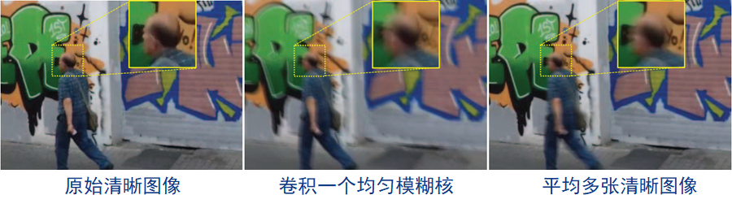

2. X. Tao, H. Gao, X. Shen, J. Wang, and J. Jia, "Scale-Recurrent Network for Deep Image Deblurring," In *Proc. IEEE Conference on Computer Vision and Pattern Recognition*, 2018, pp. 8174-8182.

    > **SRN**
    > **deep CNN** 算法的特点是**多尺度逐级优化、各尺度的参数独立**，但这也会导致参数量较大、运行时间较长的问题。在成熟的多尺度方法中，各尺度对应的参数通常是相同的，不同尺度上的参数变化会引发不稳定性，并导致非限制性解空间的问题。于是 Tao 在 Nah 工作的基础上，基于循环神经网络（Recurrent Neural Network, RNN）提出 **SRN 算法，跨尺度地共享网络权重**，显著降低训练难度的同时，提升了算法的稳定性。
    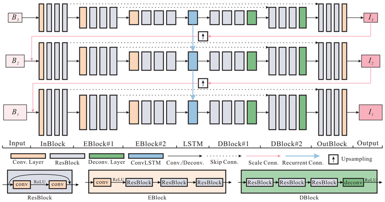
    这么做有两个好处：
    1）显著减少了训练参数的数量。即使使用相同的训练数据，重复利用共享权值的工作方式相当于多次使用数据来学习参数。
    2）作者提出的结构可以包含循环模块，其**隐藏状态**能捕获有用的信息，且有利于跨尺度的复原。
    这个网络和 Nah 的很像，也是采用多尺度【由粗到细】的金字塔策略。不同之处在于每层的输出通过上采样之后与下一层的输入相连，而 Nah 使用的是 up-convolution，另外，中间的 code 通过 ConvLSTM 传递，用于【隐藏状态 hidden state】连接连续的尺度；而 Encoder-decoder 之间使用 skip-connection，对应的特征图之间的 skip-connection 被广泛用于组合不同 levels 之间的信息，这有利于梯度的传播和加速收敛。
    而且我们可以从图片的底部看到，作者并没有直接使用传统的 Encoder-decoder 架构（没有进行 batch 归一化）。原因有三点：
    1）对于去模糊的任务，需要较大的感受野来处理剧烈的运动，这将使得 Encoder-decoder 模块堆叠更多的 levels，但由于中间特征通道数量大，导致参数数量快速增加；
    2）中间特征映射的空间尺寸太小，无法保留空间信息进行重构；
    3）在 Encoder-decoder 模块的每一层增加更多的卷积层会使网络收敛速度变慢。因此，作者通过引入【残差学习块 Residual learning blocks】来改进。也就是图中的 Eblock 和 Dblock。

3. H. Gao, X. Tao, X. Shen, and J. Jia, "Dynamic Scene Deblurring With Parameter Selective Sharing and Nested Skip Connections," In *Proc. IEEE Conference on Computer Vision and Pattern Recognition*, 2019, pp. 3843-3851.

    > **PSS-NSC**
    > 虽然 Nah 等人首先提出的【由粗到细】去模糊神经网络建立了具有独立参数的 DNN，但是它不考虑跨尺度的参数关系。而 Tao 等人提出的 SRN，虽然其参数共享方案简洁紧凑，但忽略了特征的尺度变化特性，而这对于尺度的复原非常重要。
    什么意思呢？就是说，你**所有的参数都是独立的，这不行**。但是你**所有的参数都进行共享，这也不行**。
    为此，Tao 的小学弟 Gao 设计了下图所示的网络结构：
    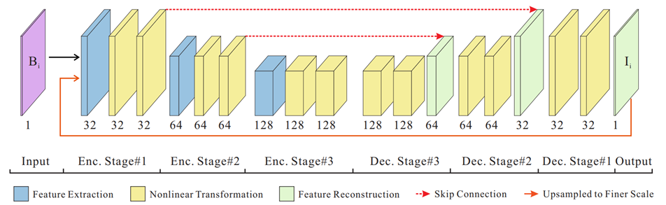
    与 Tao 所提出的 SRN 网络中堆叠的 ResBlock 不同点在于，其网络由 3 种模块组成，分别执行不同的功能，即**特征提取、非线性变换、特征重构**。并提出了一种**改进版的参数选择性共享方案**。Gao 从两个方面去考虑这个问题：
    >
    > - 哪种参数可以在尺度间共享？
    >
    >> 比如在下图一个典型的动态场景中，背景建筑是清晰的，而前景人群是模糊的，当使用“由粗到细”框架去模糊时，清晰区域的特征是近似的，下采样的清晰边缘仍旧是清晰的，而模糊区域在下采样之后却变得清晰了！这好吗？这不好！如果特征提取模块被跨尺度共享，则无法同时提取清晰特征和模糊特征，也就是说，当在粗尺度上学习清晰特征时，共享特征提取模块，将无法在细尺度上提取模糊特征
    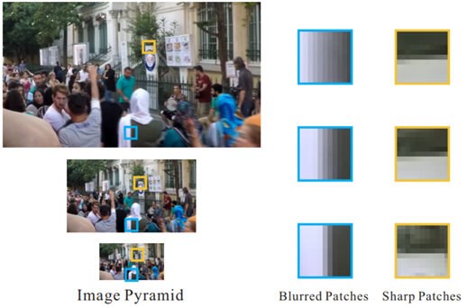
    为了解决这个问题，作者在子网络的每一阶段为特征提取模块分配独立的参数，使网络能够在每个尺度上自动提取出最具鉴别性的特征。在图中，三行 blocks 表示图像由粗到细，FE 是特征提取模块，T 是非线性变换模块，相同颜色的模块共享相同的参数。作为对比，(a)表示跨尺度间具有相同参数的SRN结构，(c)是(b)的改进版本，即在一个阶段和跨尺度间共享非线性转换参数。由于尺度变化特征的提取采用独立参数，相应的特征重构模块也采用独立参数对尺度变化特征进行处理。
    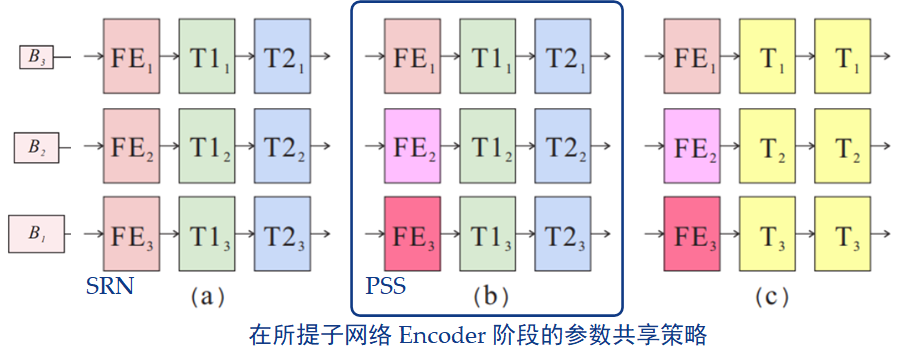
    >
    > - 不同模块间相同尺度的参数能否共享？
    >
    >> 而对于第二个问题，因为跨尺度的非线性转换模块执行相同的从模糊到清晰的 转换，所以参数可以如上图(b)所示进行跨尺度共享，这在SRN中已经得到证实
    >
    > 因为拟合残差映射比拟合期望映射更容易优化，所以 Nah 和 Tao 都选择了 ResBlocks 作为从模糊到清晰的特征转换的内部构建块，但都只是如下图(a)所示堆叠(stacked)了一阶残差函数。
    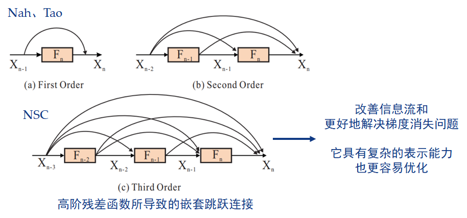
    而 Gao 在论文中的第二个贡献，是在每个尺度的子网络内部，为非线性变换模块 提出了一个【嵌套的跳跃连接 Nested Skip Connections, NSC】结构，以替代堆叠的卷积层或残差块。在整个网络中，高阶残差函数可以分组到一个嵌套模块里，以改善信息流和更好地解决梯度消失问题，它具有复杂的表示能力，也更容易优化。

4. H. Zhang, Y. Dai, H. Li, and P. Koniusz, "Deep Stacked Hierarchical Multi-Patch Network for Image Deblurring," In *Proc. IEEE Conference on Computer Vision and Pattern Recognition*, 2019, pp. 5971-5979.

    > **DMPHN**
    > Zhang 所提出的深度多片分层（DMPHN）网络如图所示
    
    先将输入的模糊图像不重叠的分成许多片，对每一片进行编码-解码处理，再传递给上一级，同时传递编码后的特征映射，构成残差块。只让最后一级的输出结果与真实值进行均方误差（MSE）比较，作为网络的损失函数
    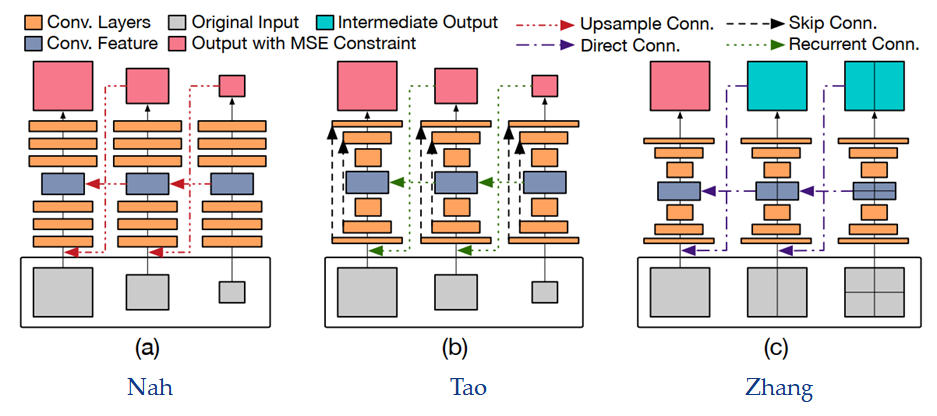
    让我们用上图做个对比。其实他这个图有点问题，比如图(a)中间的红线是不存在的，每层输出到下一层输入的红线应该是 up convolution，Nah 通过实验发现比 up sample 效果更好。而 SRN 的绿线只有中间的瓶颈层才是循环连接，另一条则是尺度卷积。但这无伤大雅，这个图的重点是在输入输出。尽管 Zhang 的模型把 skip and recurrent connections 都删除，并且由于 multi-patch 的设置，不需要网络(a)中的上采样连接，而是通过直连，使得网络结构大大简化。但它非常有效，在 GOPRO 数据集上与当前的多尺度方法相比，运行时间快 40 倍，是**第一个以 30fps 的速度拍摄 720p 图像的实时深度运动去模糊模型**。
    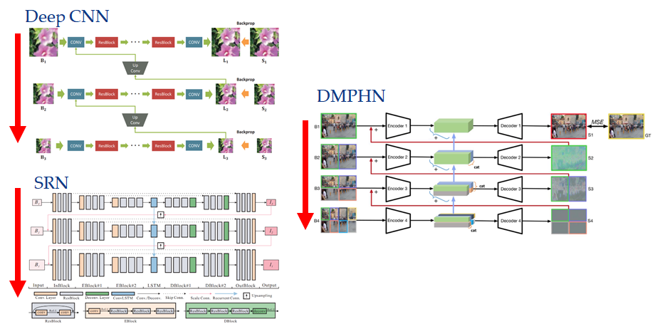
    此外，Zhang 通过实验发现，增加网络的纵向深度，并不能提高 Nah 和 Tao 网络的去模糊性能，而将模糊图像分割成更小的网格也行不通。所以 Zhang 提出了横向增加深度的想法，设计出 Stack 和 Stack-V 型网络。Stack 型网络是从最低层开始处理，到最顶层结束，然后最顶层的输出转递到下一个模型的最低层，整个过程只有在【从下往上】的时候进行去模糊。而 Stack-V 型网络是从顶层开始，到达底层，然后再返回到顶层，【从上到下】和【从下到上】的整个过程一直在进行去模糊处理，实验也证明 Stack-V 型的性能更好
    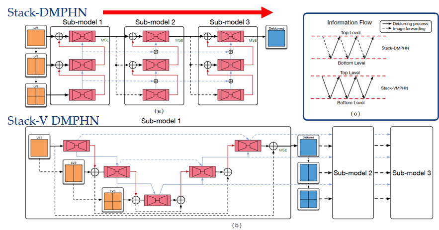

5. M. Suin, K. Purohit, and A. Rajagopalan, "Spatially-Attentive Patch-Hierarchical Network for Adaptive Motion Deblurring," In *Proc. IEEE Conference on Computer Vision and Pattern Recognition*, 2020, pp. 3603-3612.

    > **CA-PHN**
    > Suin认为运动模糊具有方向性，且导致每个图像实例模糊的运动方向都各不相同，应该对所输入的每个测试图像的模糊进行自适应，故而设置了一个【内容感知 content-aware, CA】模块，用于调整滤波器和每个像素的感受野。他相对于Zhang Hongguang的创新点在于：
    1）避免网络沿深度的级联（这将严重增加计算负担），而是使用内容感知模块；
    2）设置了跨层次的 attention，以便在整个网络中有效地传播较低层次的特征；
    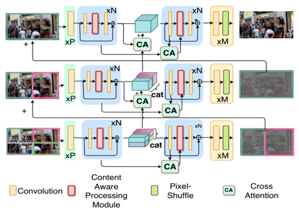

### GAN

1. T. Nimisha, A. Singh, and A. Rajagopalan, "Blur-Invariant Deep Learning for Blind-Deblurring," In *Proc. IEEE International Conference on Computer Vision*, 2017, pp. 4762-4770.

    > **AEGAN**

2. O. Kupyn, V. Budzan, M. Mykhailych, D. Mishkin, and J. Matas, "DeblurGAN: Blind Motion Deblurring Using Conditional Adversarial Networks," In *Proc. IEEE Conference on Computer Vision and Pattern Recognition*, 2018, pp. 8183-8192.

    > **DeblurGAN** - 需要成对图像
    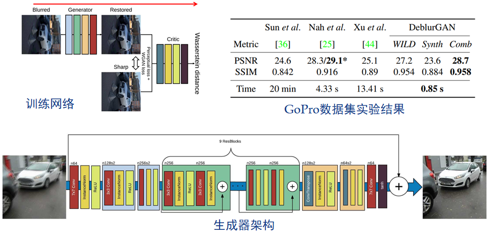
    此外，在数据集方面，相对于 Nah 所提出的平均多张清晰图像来模拟模糊的方法，Kupyn 认为，这么做虽然能够创建逼真的模糊图像，但却将图像空间仅限于拍摄视频中的场景，并使数据集的缩放变得复杂。就是说，对数据库的**类型和内容**依赖度太高。所以 Kupyn 借鉴随机轨迹生成的思想，通过对轨迹向量应用亚像素插值，来生成模糊核。这样就可以在任意的真实数据集上，生成人造的运动模糊图像。
    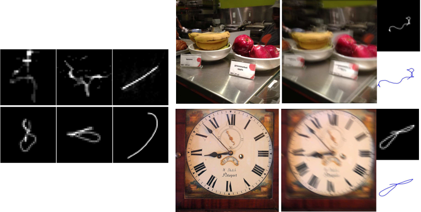
    但是现实生活中的动态场景模糊图像，都是局部不均匀的，如果每个像素都生成对应的模糊核，计算量巨大；且局部模糊区域中像素之间的模糊核是由一定相关性的，比如一张街景中人脸水平移动产生人脸局部的均匀模糊，而背景都是清晰的，这种情况如何处理？需要人为分割区域进行单独处理吗？更不论局部均匀模糊的假设是否成立。因此该方法治标不治本。

3. O. Kupyn, T. Martyniuk, J. Wu, and Z. Wang, "DeblurGAN-v2: Deblurring (Orders-of-Magnitude) Faster and Better," In *Proc. IEEE International Conference on Computer Vision*, 2019, pp. 8877-8886.

    > **DeblurGAN-v2**
    > 其创新点有两个：
    1）在网络框架上，对于生成器，作者首次将最初用于目标检测的【特征金字塔网络 Feature Pyramid Network, FPN】引入到图像恢复任务中，并把这种新方法看作是合并多尺度特征的轻量级替代方案；对于判别器，作者采用一个包含最小平方损失的相对判别器，并且有两列分别评估全局(图像)和局部(patch)尺度。
    2）在效率方面也有大幅提升，显示出可以应用于视频去模糊的可能。
    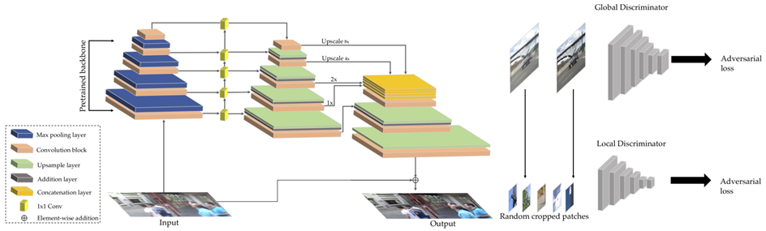
    > 此外，通过将整个网络中的所有普通卷积（包括那些不在主干中的）替换为【深度可分离卷积 Depthwise Separable Convolution, DSC】，以提供非常轻量和有效的图像去模糊能力。

4. P. Sakurikar, I. Mehta, V. Balasubramanian, and P. Narayanan, "RefocusGAN: Scene Refocusing Using A Single Image," In *Proc. European Conference on Computer Vision*, 2018, pp. 519-535.

    > **RefocusGAN**
    > 本文提出了 RefocusGAN，通过去模糊再模糊的方式来对实现对单张图片进行重新对焦的功能。
    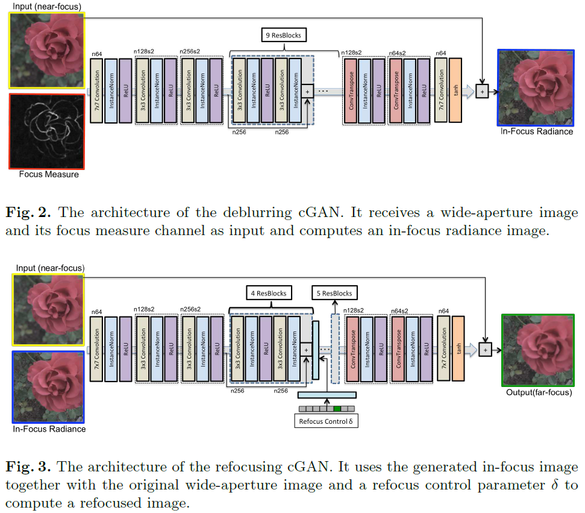
    > 去模糊的过程由一个 Conditional GAN 完成，训练数据为一张近焦图片和 Focus measure response（下图中的黑白图），基于以上两组数据生成全清晰的中距离对焦图片，再基于近焦图片和中焦图片来生成远焦图片。
    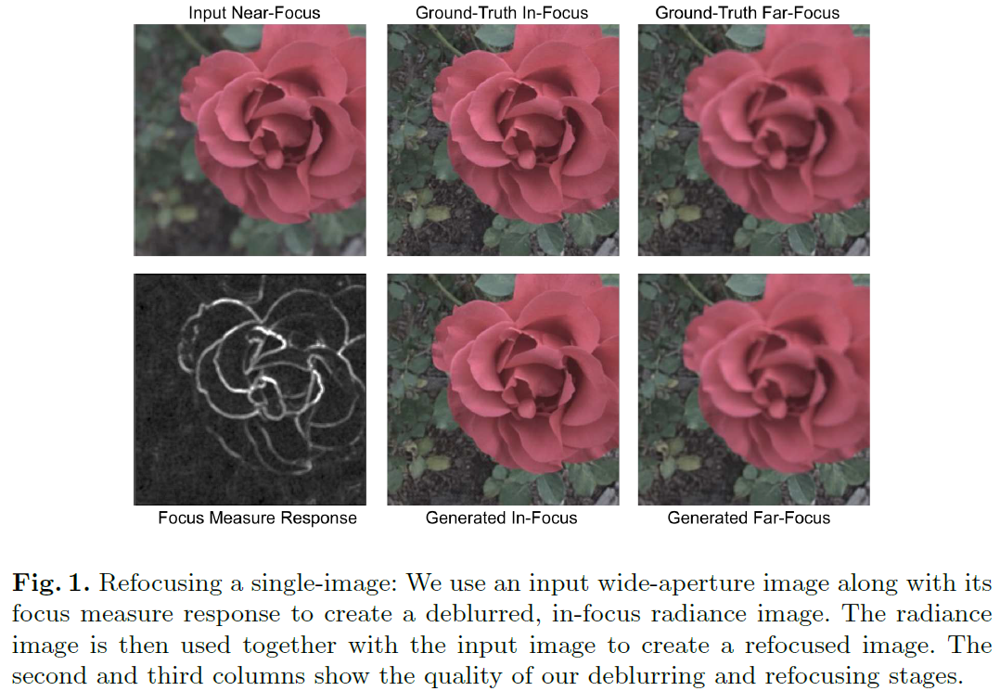
    >>
    > [Parikshit Sakurikar](https://researchweb.iiit.ac.in/~parikshit.sakurikar/)，[印度海德拉巴大学 IIIT-Hyderabad](https://www.iiit.ac.in/) [视觉信息技术中心 Center for Visual Information Technology](https://cvit.iiit.ac.in/) 在读博士，与 P. J. Narayanan 教授一起研究与计算摄影和机器学习相关的主题。主要研究领域是 Epsilon Focus Photography，它涉及捕捉和处理多焦点图像、焦点深度、焦点/散焦模糊的测量以及景深的后期控制。此外，对计算机视觉、计算机图形和高性能计算也很感兴趣。

5. K. Zhang, W. Luo, Y. Zhong, L. Ma, B. Stenger, W. Liu, and H. Li, "Deblurring by Realistic Blurring," In *Proc. IEEE Conference on Computer Vision and Pattern Recognition*, 2020, pp. 2734-2743.

    > **DBGAN**
    > 为了解决去模糊算法在训练时使用的合成数据不能真实模拟图像模糊的问题，Zhang 提出了一种包含两个 GAN 模型的方法，即学习模糊的 GAN（BGAN）和学习去模糊的 GAN（DBGAN）。
    > 第一个模型 BGAN 学习如何使用未配对的清晰和模糊图像集对清晰图像进行模糊处理，生成更能反映现实世界图像模糊的数据集——RWBI，然后指导第二个模型 DBGAN 学习如何正确对此类图像进行模糊处理。

6. S. Lim, H. Park, S. Lee, S. Chang, B. Sim, and J. Ye, "CycleGAN with A Blur Kernel for Deconvolution Microscopy: Optimal Transport Geometry," *IEEE Transactions on Computational Imaging*, vol. 6, pp. 1127-1138, 2021.

    > **CycleGAN**
    > CycleGAN[^4] 是发表在 ICCV2017 关于将 GAN 应用在无监督的图像到图像翻译（image-to-image translation）的著名算法，和应用于有监督图像翻译的 pix2pix 几乎是同一批作者。
    > CycleGAN 最大的特点是无监督，也就是不要求训练数据是成对的，只需要提供不同域（domain）的图像就能成功训练不同域之间图像的映射（或者叫翻译），这大大降低了图像翻译的门槛，毕竟某些类型的成对数据并不容易获取，比如同一个场景的夏天照片和冬天照片、同样造型的斑马和马等，因此 CycleGAN 是非常棒的一个作品。
    >>
    > 关于成对和非成对数据的对比可以看下图，左边是成对的数据，也就是 pix2pix 算法所使用的训练数据；右边是非成对的数据，$X$ 和 $Y$ 是不同域的数据，不同域的例子比如夏天和冬天、斑马和马、苹果和橘子等。
    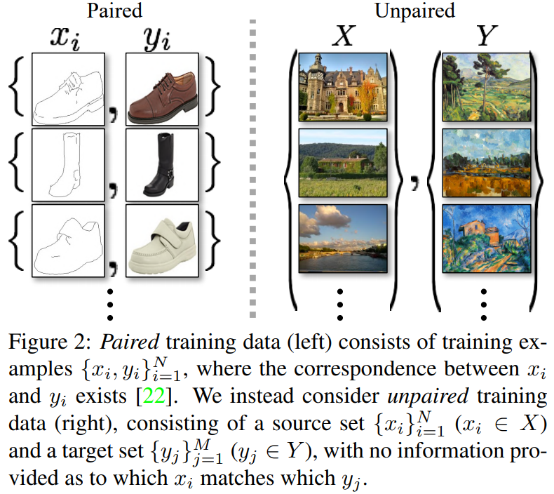
    >>
    > CycleGAN 算法的整体示意图如下图所示，整体上包含 2 个 GAN 网络。
    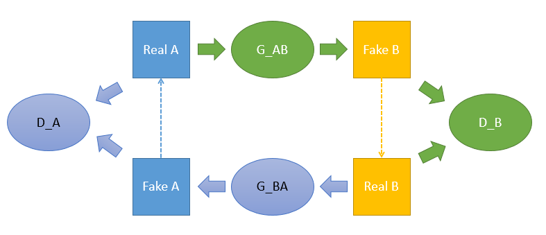
    >>
    > 该论文的创新点在于只需要一个深度生成器和一个线性模糊核，就可以用于非盲和盲图像去卷积。显著提高了网络训练的鲁棒性和效率。
    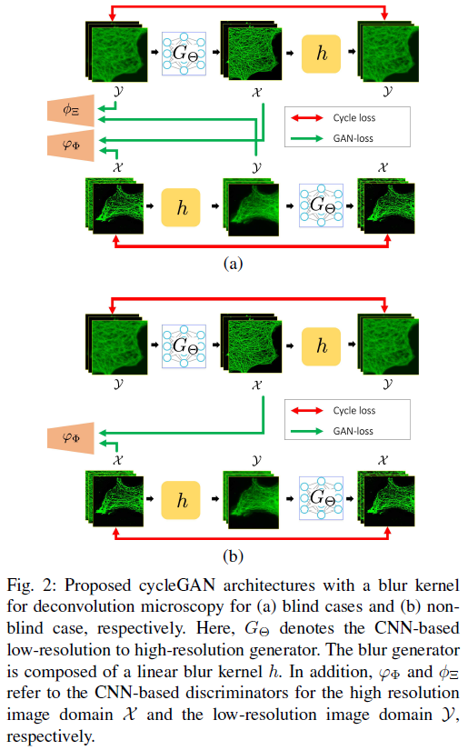
    >>
    > [^4]: J. Y. Zhu, T. Park, P. Isola, and A. Efros, "Unpaired Image-to-Image Translation Using Cycle-Consistent Adversarial Networks," In *Proc. IEEE International Conference on Computer Vision*, 2017, pp. 2242-2251.
    >>
    > 韩国？

### 其他

1. J. Zhang, J. Pan, J. Ren, Y. Song, L. Bao, R. Lau, and M. Yang, "Dynamic Scene Deblurring Using Spatially Variant Recurrent Neural Networks," In *Proc. IEEE Conference on Computer Vision and Pattern Recognition*, 2018, pp. 2521-2529.

    > **RNN**
    > 该神经网络由三个 CNN 和一个 RNN 组成，第一个 CNN 用于提取模糊图像的特征映射，传递到具有反卷积运算功能的 RNN，同时第二个 CNN 学习 RNN 在四个不同方向的权重，第三个 CNN 进行图像重建。此外，每个 RNN 后面都加一个卷积层来融合信息。
    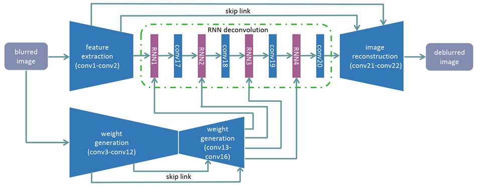
    > 该论文的主要贡献在于证明了反卷积，也就是去模糊步骤，等价于一个【无限脉冲响应 IIR】模型，并且可以被 RNNs 近似。
    > 此外，利用 CNN 去学习 RNN 不同方向上的权重，有利于空间变化模糊的去除
    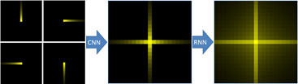

2. Y. Yuan, W. Su, and D. Ma, "Efficient Dynamic Scene Deblurring Using Spatially Variant Deconvolution Network with Optical Flow Guided Training," In *Proc. IEEE Conference on Computer Vision and Pattern Recognition*, 2020, pp. 3552-3561.

    > **OFG-CCN**

3. Y. Nan, Y. Quan, and H. Ji, "Variational-EM-Based Deep Learning for Noise-Blind Image Deblurring," In *Proc. IEEE Conference on Computer Vision and Pattern Recognition*, 2020, pp. 3623-3632.

    > 基于**变分期望最大化 Variational-EM-Based**（EM）框架，提出了一种融合噪声水平估计和图像先验不确定性量化的迭代噪声盲去模糊方案。
    > 提出使用**分析-合成网络对**去模糊，分析网络估计模糊核，合成网络使用此模糊核去模糊。论文中的表述是一个网络学习图像先验，另一个网络量化先验不确定性。
    >>
    > [Yuesong Nan](https://www.linkedin.com/in/yuesongnan/?originalSubdomain=sg)，新加坡国立大学博士
    > [Yuhui Quan 全宇晖](https://csyhquan.github.io/)，华南理工大学副教授

## 评价指标

### 峰值信噪比 Peak Signal to Noise Ratio, PSNR

峰值信噪比提供了一个衡量图像失真或是噪声水平的客观标准，常用于图像压缩等领域压缩前后图像劣化程度的客观评价。它是原图像与被处理图像之间的均方误差相对于 $(2^n-1)^2$ 的对数值（信号最大值的平方，n 是每个采样值的比特数）。评价结果以 dB（分贝）为单位表示。两个图像间的劣化程度较大时，PSNR值趋于 0 dB.

$PSNR=10\log_{10}\left(\frac{MAX_{I}^{2}}{MSE}\right)$

其中，$MAX_{I}^{2}$ 表示图像中可能的最大像素值的平方。一般地，针对 uint8 数据，最大像素值为 255；针对浮点型数据，最大像素值为 1。

PSNR 是最普遍，最广泛使用的评鉴画质的客观量测法，不过许多实验结果都显示，PSNR 的分数无法和人眼看到的视觉品质完全一致，有可能 PSNR 较高者看起来反而比 PSNR 较低者差。这是因为人眼的视觉对于误差的敏感度并不是绝对的，其感知结果会受到许多因素的影响而产生变化（例如：人眼对空间频率较低的对比差异敏感度较高，人眼对亮度对比差异的敏感度较色度高，人眼对一个区域的感知结果会受到其周围邻近区域的影响）。

### 结构相似性 Structural SIMilarity, SSIM

SSIM 是一种衡量两幅图像相似度的指标。该指标首先由德州大学奥斯丁分校的【图像和视频工程实验室 Laboratory for Image and Video Engineering】提出。SSIM使用的两张图像中，一张为未经压缩的无失真图像，另一张为失真后的图像。

给定两个图像 $x$ 和 $y$，两张图像的结构相似性可按照以下方式求出：

$\operatorname{SSIM}(x, y)=\frac{\left(2 \mu_{x} \mu_{y}+c_{1}\right)\left(2 \sigma_{x y}+c_{2}\right)}{\left(\mu_{x}^{2}+\mu_{y}^{2}+c_{1}\right)\left(\sigma_{x}^{2}+\sigma_{y}^{2}+c_{2}\right)}$

其中 $\mu_{x}$ 是 $x$ 的平均值，$\mu_{y}$ 是 $y$ 的平均值，$\sigma_{x}^2$ 是 $x$ 的方差，$\sigma_{y}^2$ 是 $y$ 的方差，$\sigma_{xy}$ 是 $x$ 和 $y$ 的协方差。$c_{1}=\left(k_{1}L\right)^2$，$c_{2}=\left(k_{2}L\right)^2$ 是用来维持稳定的常数。$L$ 是像素值的动态范围。$k_{1}=0.01$，$k_{2}=0.03$

结构相似性的范围是 $[-1, 1]$。当两张图像一模一样时，SSIM 的值等于 1。

作为结构相似性理论的实现，【结构相似度指数 Structural Similarity Index Measure, SSIM】从图像组成的角度将结构信息定义为独立于亮度、对比度的，反映场景中物体结构的属性，并将失真建模为 **亮度 Luminance、对比度 Contrast 和结构 Structure** 三个不同因素的组合。用均值作为亮度的估计，标准差作为对比度的估计，协方差作为结构相似程度的度量。

## 相关实验室

1. [腾讯优图实验室 Tencent YouTu X-Lab](https://open.youtu.qq.com/#/open)

    [港中大计算机科学与工程系多媒体实验室 Department of Computer Science and Engineering, the Chinese University of Hong Kong(CUHK), Multimedia Lab](http://mmlab.ie.cuhk.edu.hk/)

    > [J. Jia 贾佳亚](https://jiaya.me/) - [香港中文大学教授](https://www.cse.cuhk.edu.hk/people/faculty/jiaya-jia/)、腾讯优图实验室联合负责人、思谋科技创始人 - 透明度先验 2007
    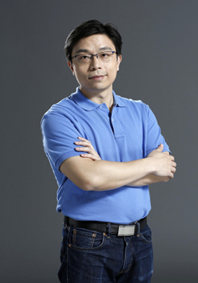
    >> 学生：
    >>
    >> [X. Shen 沈小勇](http://xiaoyongshen.me/) - 思谋科技 CEO - 重尾分布先验 2008
    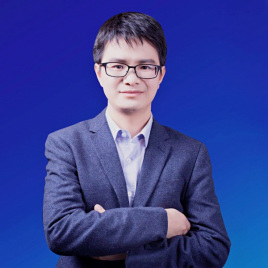
    >>
    >> [Q. Shan](http://shanqi.github.io/)，在 [西雅图华盛顿大学计算机科学与工程系 Computer Science and Engineering, CSE](https://www.cs.washington.edu/) 获得博士学位，在港中大CSE获得硕士学位，研究兴趣包括计算机图形学、计算机视觉和机器学习。
    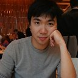
    >>
    >> [X. Tao 鑫陶](http://xtao.website/) - 腾讯优图高级研究员 - SRN 2018
    I am currently a Senior Researcher in YouTu X-Lab of Tencent, since 2018. Previously, I was a Ph.D. student in Computer Science and Engineering Department in the Chinese University of Hong Kong (CUHK) since 2013. My supervisor is Prof. Jiaya Jia. Before that, I received the B. Eng. degree in Information Engineering from Shanghai Jiao Tong University (SJTU) in 2013, supervised by Prof. Guangqiang He.
    My research interest includes image processing and computer vision.
    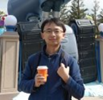
    >>
    >> H. Gao - 腾讯优图研究员 - PSS-NSC 2019
    

2. [南京理工大学智能媒体分析实验室 Intelligent Media Analysis Group (IMAG), School of Computer Science, Nanjing University of Science and Technology](https://imag-njust.net/jinshan-pan/)

    > [J. Pan 潘金山](https://jspan.github.io/) - 南京理工大学教授 - 暗通道先验 2016
    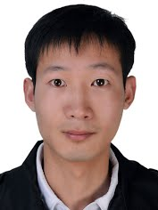
    >>
    >> [J. Zhang 张佳维](https://sites.google.com/site/zhjw1988/) - 香港城市大学 CS 2018级博士学位 - 就职于商汤科技 SenseTime Research - RNN 2018
    Zhang Jiawei currently works for SenseTime Research. He has obtained a PhD degree from CS of City University of Hong Kong in 2018, a master degree from Institute of Acoustics, Chinese Academy of Sciences (IACAS) in 2014 and a bachelor degree from EEIS of University of Science and Technology of China (USTC) in 2011. He has visited UCLA and UC Merced in 2013 and 2017 respectively. He also has an internship in SenseTime Research in 2017 and Jingchi Corp in 2018.
    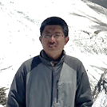

3. [首尔国立大学计算机视觉实验室 Seoul National University, Computer Vision Lab](https://cv.snu.ac.kr/)

    > [K. M. Lee](https://cv.snu.ac.kr/index.php/kmlee/) - 韩国首尔大学人工智能研究所主任兼教授
    **Kyoung Mu Lee** received the BS and MS degrees in control and instrumentation engineering from Seoul National University (SNU), Seoul, Korea in 1984 and 1986, respectively, and the PhD degree in electrical engineering from the University of Southern California (USC), Los Angeles, California in 1993. He received the Korean Government Overseas Scholarship during the PhD courses. From 1993 to 1994, he was a research associate in the Signal and Image Processing Institute (SIPI) at USC. He was with the Samsung Electronics Co. Ltd. in Korea as a senior researcher from 1994 to 1995. In August 1995, he joined the Department of Electronics and Electrical Engineering of the Hong-Ik University, and was an assistant and associate professor. Since September 2003, he has been with the Department of Electrical and Computer Engineering at Seoul National University as a professor, and leads the Computer Vision Laboratory. His primary research is focused on statistical methods in computer vision that can be applied to various applications including object recognition, segmentation, tracking and 3D reconstruction.
    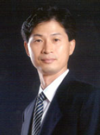
    >
    >> 学生：
    >>
    >> [T. H. Kim](https://sites.google.com/site/lliger9/) - [汉阳大学助理教授 Hanyang University, Assistant Professor](https://hanyang.elsevierpure.com/en/persons/tae-hyun-kim)
    **Tae Hyun Kim** received the BS degree and the MS degree in the department of electrical engineering from KAIST, Daejeon, Korea, in 2008 and 2010, respectively. He is currently(2016) working  toward the PhD degree in Electrical and Computer Engineering at Seoul National University. His research interests include motion estimation, and deblurring. He is a student member of the IEEE.
    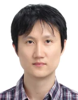
    >>
    >> [S. Nah](https://seungjunnah.github.io/)
    **Seungjun Nah** received the BS degree in Electrical and Computer Engineering from Seoul National University (SNU), Seoul, Korea in 2014. He is currently(2016) working towards PhD degree in Electrical and Computer Engineering at Seoul National University. He is interested in computer vision problems including deblurring and visual saliency. He is a student member of the IEEE.
    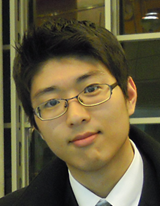

4. [澳大利亚国立大学机器人视觉研究中心 The Australian National University(ANU), Australian Center for Robotic Vision(ACRV)](https://roboticvision.org/)

    > [H. Li 李宏东](http://users.cecs.anu.edu.au/~hongdong/) - [ANU教授](https://roboticvision.org/person/hongdong-li/) - 浙江大学1996届硕士和2000届博士
    Computer Vision, Machine Learning, Associate Director (Research) , ANU , Chief Investigator, Australia Centre for Robotic Vision. Research Leader. Area Chair for IEEE ICCV, IEEE CVPR, ECCV, and BMVC. Associate Editor IEEE Transactions on PAMI, Main research areas: 3D computer vision, navigation, reconstruction, SFM and 3D vision modelling, virtual reality and augmented reality, robot vision navigation and SLAM, machine learning, multimedia information retrieval, autonomous driving (self-driving car visual navigation system), image recognition, human robot interaction, image understanding, medical imaging, visual data analysis, and UAV drone autonomous flying, bionic eye for helping blind person.
    
    >
    >> 学生
    >>
    >> [H. Zhang 张洪广](https://hongguangzhang.github.io/) - DMPHN 2019
    I am an assistant professor in Systems Engineering Institute, AMS now.
    I obtained the PhD from CECS of Australian National University (ANU) and Data61/CSIRO in 2020. Before this, I graduated from Shanghai Jiao Tong University (SJTU) for B.Eng in Electrical Engineering and Automation in 2014, then obtained the M.Eng from National University of Defense Technology (NUDT) in 2016.
    My main research topics are computer vision and machine learning. Specifically, I am currently doing research works on zero-shot learning, few-shot learning, domain adaptation with deep learning approaches. I am also interested in some low-level vision tasks, e. g. image and video deblurring.
    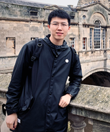

5. [印度理工学院马德拉斯分校电气工程系图像处理与计算机视觉实验室 Department of Electrical Engineering, Indian Institute of Technology(IIT) Madras, India, Image Processing and Computer Vision lab(IPCV)](http://www.ee.iitm.ac.in/ipcvlab/)

    > [A. N. Rajagopalan](http://ee.iitm.ac.in/~raju/) - 教授
    Dr. A. N. Rajagopalan received the B.E. and the M. Tech. degrees in Electronic Engineering from Nagpur University, Nagpur, and the Ph.D degree in Electrical Engineering from the Indian Institute of Technology, Bombay in July 1998.
    During the summer of 1998, he was a visiting scientist at the Image Communication Lab, University of Erlangen, Germany. He joined the Center for Automation Research, University of Maryland in October 1998 and was a research faculty till September 2000. He joined the Department of Electrical Engineering, IIT Madras as Assistant Professor in October 2000 and currently serves as Professor.
    His current research interests include recovering depth from defocused images, structure from motion blur, image restoration and super-resolution, video microscopy, image and depth inpainting, image matting, tensor voting, heritage resurrection, higher-order statistical learning, object detection in still images and video, face detection and recognition, image forensics, and underwater imaging.
    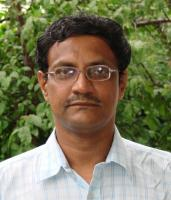
    >
    >> 学生
    >>
    >> [T. M. Nimisha](https://nimiiit.github.io/) - AEGAN2017
    **Thekke Madam Nimisha** is Algorithm Development Engineer with Ebeam division KLA+, Chennai, India. I started my industrial journey in Jan 2019 prior to which I worked at Image Processing and Computer Vision lab under the supervision of Prof. A N Rajagopalan, IIT Madras, as a Ph.D. scholar. My thesis addressed the problems of hand-held imaging (mainly resolution and motion blur) and proposed several multi and single image approaches to overcome it. I did my Masters from NIT Calicut in Signal Processing (2011-13), where I worked with Dr. G Abhilash in Compressed sensing based signal recovery techniques. I am a passionate researcher and have worked on multiple image restoration, detection and classification tasks covering traditional image processing methods to to the latest deep learning techniques.
    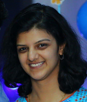
    >>
    >> [M. Suin](https://maitreyasuin.github.io/) - CA-PHN 2020
    **Maitreya Suin** is a PhD student at Image Processing and Computer Vision Lab, IIT Madras. I received my Bachelors Degree in Electronics and Communications Engineering from Institute of Engineering and Management, Kolkata. My research lies at the intersection of Computer Vision, Deep Learning and Deep Reinforcement Learning. My recent works have focused on efficient dense video captioning with the help of reinforcement learning and transformer, video enhancement using efficient attention modules, restoration of images suffering from blur, low-resolution, rain and haze.
    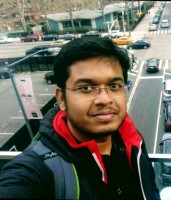

6. 西工大

    > [Y. Dai 戴玉超](https://teacher.nwpu.edu.cn/en/daiyuchao) - DMPHN
    > [Y. Zhang 张艳宁](https://teacher.nwpu.edu.cn/m/1999000059.html) - 基于FCN的端到端运动流图估计算法
